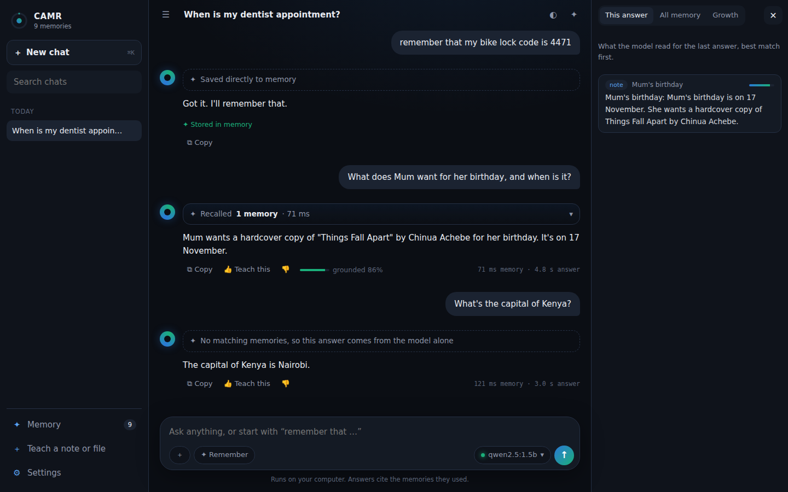
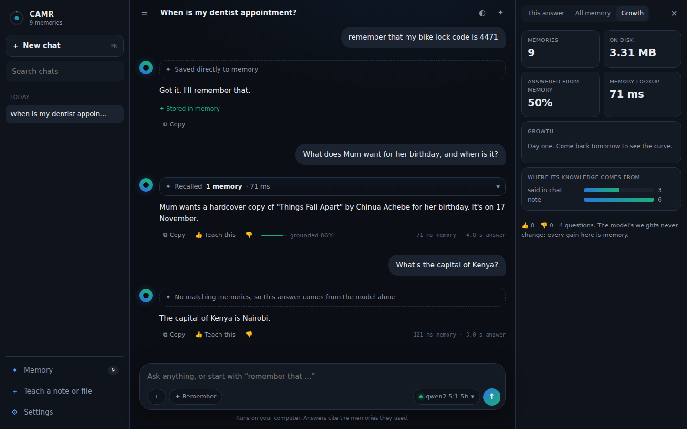
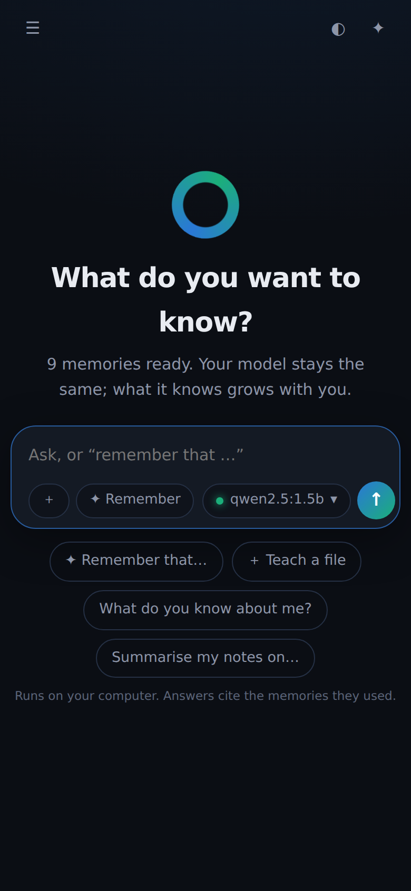

# CAMR Personal: your model, a memory that grows

CAMR Personal is the research engine packaged as a desktop app. You bring any model you already have in
[Ollama](https://ollama.com). CAMR gives it a **long-term memory** built from:
- your notes and files;
- what you tell it in chat;
- answers you approve.

The model's weights never change. It gets more useful as its memory grows, and that costs **storage, not
compute**. Memory isn't limited by the context window either: each question reads only the few memories it needs.



## Download

Get the file for your computer from the **[latest release](https://github.com/Satasdin/CAMR/releases/latest)**:

| Computer | File |
|---|---|
| Windows (Intel/AMD) | `camr-personal-windows-x64.zip` |
| Windows on ARM (Snapdragon) | `camr-personal-windows-arm64.zip` |
| Mac with Apple Silicon (M1–M4) | `camr-personal-macos-arm64.tar.gz` |
| Mac with Intel | `camr-personal-macos-x64.tar.gz` |
| Linux x64 | `camr-personal-linux-x64.tar.gz` |
| Linux ARM64 | `camr-personal-linux-arm64.tar.gz` |

Then:
1. Install **Ollama** from <https://ollama.com/download>, open it, and pull a chat model:
   `ollama pull qwen2.5:1.5b`
2. Unzip and run `camr-personal`. Your browser opens at <http://127.0.0.1:8502>.
   - **Windows:** if SmartScreen warns, choose *More info → Run anyway*. The download isn't code-signed yet.
   - **macOS:** the first time, right-click the file and choose *Open*. Or run `xattr -d com.apple.quarantine camr-personal`.
3. On first run, click **Download memory model**. This fetches `nomic-embed-text` (about 270 MB) through Ollama, once.

Keep the window that opened while you use CAMR. Close it, or press Ctrl+C, to quit.

**With Python instead:**
```
pip install "camr[app] @ git+https://github.com/Satasdin/CAMR.git"
camr app
```
Add `--window` to open it in a native window (needs `pip install pywebview`).

## Using it

| You do | What happens |
|---|---|
| Ask anything | A **Recalled N memories** card shows what it read (Kimi-style, before the answer). The answer streams in, with a **grounded %** meter. |
| Type **remember that …**, or toggle **✦ Remember** | The fact is stored instantly, with no model call. |
| **👍 Teach this** | The answer is stored as memory and reused next time. |
| Drop a `.txt`, `.md` or `.pdf` anywhere, or use **＋** | The file is learned. |
| Open the **✦ memory panel** | Three tabs: *This answer* (what was read), *All memory* (search, and Forget), and *Growth*. |
| Switch models | Use the picker inside the message box. The models come from your Ollama. |

Chats are listed in the sidebar like any chat app. What you say is also stored as memory, so it can be recalled in
**any** chat, weeks later, long after it would have dropped out of a context window.

| Growth panel | Phone-sized window |
|---|---|
|  |  |

## How it differs from plain RAG

| | Plain RAG | CAMR Personal |
|---|---|---|
| What goes in | Documents you index once | Documents **plus** chat, "remember that…" and approved answers, **as you use it** |
| How much is read | Fixed top-k | **Gated**: abstains when nothing is relevant, and admits only notes close to the best match |
| Multi-step questions | Similarity only | **Entity bridging**: a note naming another entity pulls that entity in. On 2WikiMultiHopQA, full-evidence recall went from 36% to 78%. |
| Long conversations | Truncated at the context window | What you said becomes memory and is recalled when it matters |
| Honesty | Usually silent | Shows the memories used and how grounded the answer is, or says it found nothing |

## Which model should I use?

Measured on a 4-core laptop-class CPU with no GPU (`docs/FINDINGS.md`, F10 and F13):

| Your RAM | Model | With CAMR: facts / multi-step | Seconds per answer |
|---|---|---|---|
| 4–8 GB | `qwen2.5:1.5b` | 80% / 41–50% | ~2–3 s |
| 8–16 GB | `llama3.2:3b` | 73% / 54–57% (matches a frontier cloud model) | ~4–6 s |
| 16 GB+ | `qwen2.5:14b`, `gemma3:12b` | 73–79% / 63% | ~16–24 s on CPU; much faster on a GPU or Apple Silicon |

**Speed.** The app loads your model in the background when it starts and when you switch models, so the first answer does not wait for it: first word in about 0.6 s (0.5B), 0.9 s (1.5B) and 1.7 s (3B) on a 4-core CPU. Each answer shows its time to the first word. Memory size hardly matters: about 6,000 notes are looked up in under 60 ms.

## Privacy

- **Local only.** Everything lives in `~/.camr/`. The app listens only on 127.0.0.1, talks only to the Ollama
  on your machine, and refuses requests from other hosts or websites.
- **Your data, your files.** Back it up by copying the folder; delete the folder to wipe it.
- **Feedback is opt-in.** **Settings → Download feedback file** exports numbers only (counts, timings, 👍/👎).
  Your messages are included only if you tick the box.

## Feedback

Open a [feedback issue](https://github.com/Satasdin/CAMR/issues/new?template=feedback.yml). We especially want to
know:
- whether answers got better as you taught it more;
- what it got wrong;
- how fast it was on your machine.

## Build it yourself

`python packaging/build.py` builds the executable for the current OS and CPU (PyInstaller).
`.github/workflows/release-app.yml` builds all six on GitHub and attaches them to a release when a `v*` tag is pushed.
