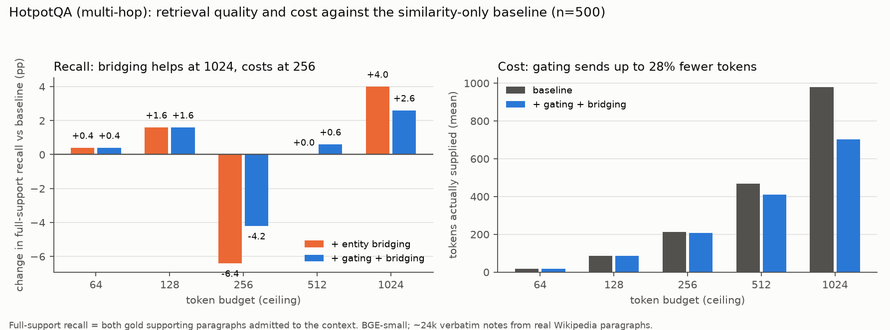
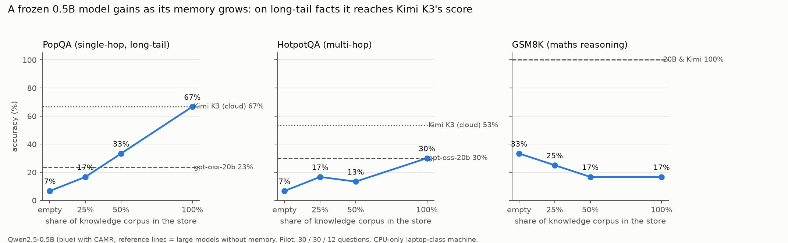
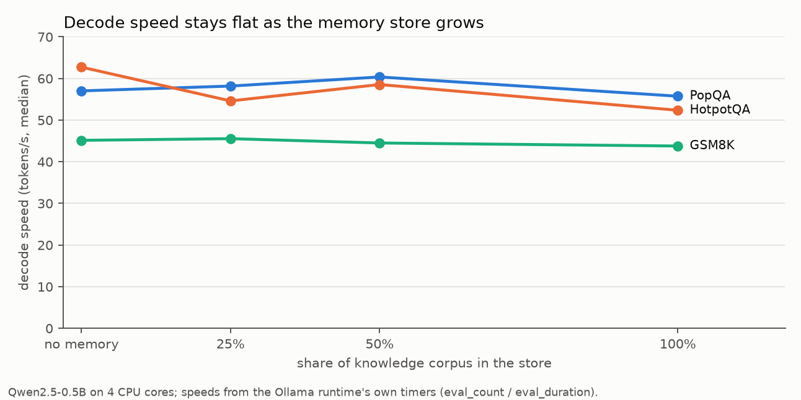
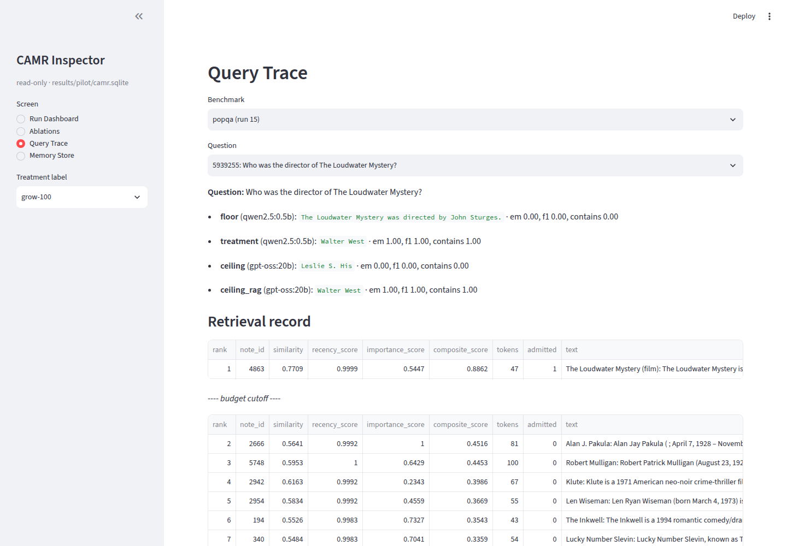
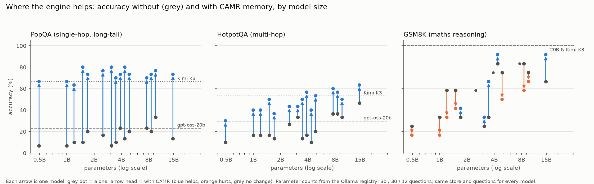
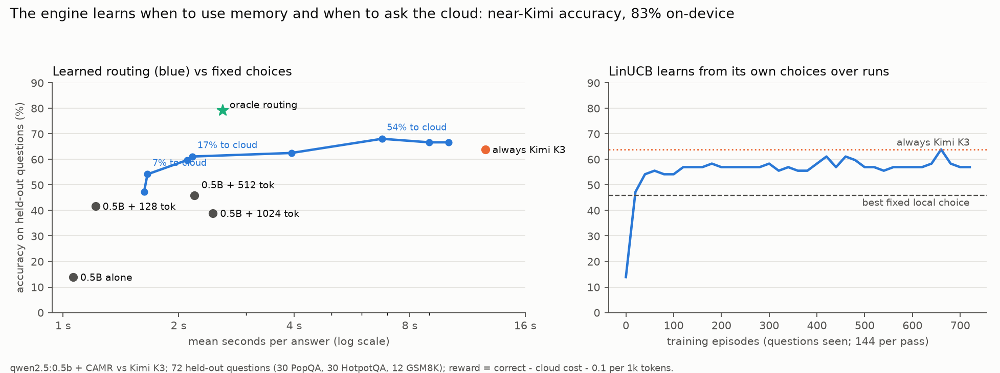

# CAMR findings log

A running record of what was **measured** with real models and real data. Every
number below was produced by the code in this repository, and the file it comes
from is named. Nothing here is estimated or synthetic. Runs still in progress are
listed at the end, and this log is updated as they finish.

Last updated: 2026-10-01.

---

## 0. Setup used for these measurements

| Item | Value |
|---|---|
| Machine | Cloud container, 4 vCPU Intel Xeon @ 2.10 GHz, 16 GB RAM (14.3 GB usable by processes), no GPU |
| Small on-device model | `qwen2.5:0.5b` (Ollama 0.35.0, Q4, greedy decoding, temperature 0, seed 13) |
| Large comparison model, local | `gpt-oss:20b` (21B total / 3.6B active, MoE; `think: low`), via Ollama with memory-mapped weights |
| Large comparison model, cloud | `kimi-k3` (Moonshot API; the API accepts only temperature 1, so it is **not** greedy) |
| Embedder | `BAAI/bge-small-en-v1.5` (384-d) on CPU, PyTorch 2.14.1 |
| Store | One SQLite file with `sqlite-vec` 0.1.9 |
| Data (all real, none synthetic) | HotpotQA dev distractor (7,405 q), 2WikiMultiHopQA dev (12,576 q), GSM8K test (1,319) and train (7,473), PopQA (14,267 q) + 120 real Wikipedia summaries fetched for its corpus |

**What is real.** HotpotQA questions were written by crowd workers over real Wikipedia paragraphs. GSM8K problems and solutions were written by human annotators. PopQA questions come from templates over real Wikidata facts, and its documents are real Wikipedia text. 2WikiMultiHopQA is built from real Wikipedia/Wikidata. The only synthetic data in the repository is the handful of unit-test fixtures in `tests/fixtures/`, and none of it enters any result here.

---

## F1. Retrieval: does the gold evidence reach the model? (no LLM needed)

Source: `results/retrieval_eval/tables/retrieval_eval.json` (`camr retrieval-eval --config configs/retrieval_eval.yaml`).
Setup: 500 HotpotQA dev questions; a store of **24,475 notes** from **14,567 real paragraphs** (103.8 MB file). Ingestion took 622 s, of which 569 s was embedding.

| Read path (budget 512 unless noted) | Both gold paragraphs in context | At least one | Tokens supplied | Recall per 1k tokens |
|---|---|---|---|---|
| Similarity only (baseline) | 72.0% | 98.8% | 468 | 1.54 |
| + recency & importance (the proposal's Eq. 4.1) | **67.4%** | 98.6% | 467 | 1.44 |
| + gating | 65.4% | 98.6% | 376 | 1.74 |
| + entity bridging (no gating) | 72.0% | 97.2% | 470 | 1.53 |
| **Similarity + gating + bridging** | **72.6%** | 97.2% | **411** | **1.77** |
| Baseline @ 1024 | 81.0% | 99.4% | 979 | 0.83 |
| Similarity + gating + bridging @ 1024 | **83.6%** | 99.4% | **702** | 1.19 |
| Baseline @ 256 | 53.4% | 96.4% | 212 | **2.52** |

**Findings**
1. **The recency and importance terms of Eq. 4.1 hurt retrieval** on independent questions: full-support recall fell 4.6 points (72.0 → 67.4%). This confirms the critique in `DESIGN_NOTES.md` A1.
2. **The best read path is similarity + gating + bridging.** At a 1,024-token ceiling it raised full-support recall by 2.6 points while sending **28% fewer tokens** (702 vs 979).
3. **Bridging depends on the budget.** It adds +4.0 points at 1,024 tokens but costs 6.4 points at 256, where bridged notes crowd out direct hits.
4. **Recall per token peaks at a 256-token budget** (2.52 per 1k tokens). That is objective v's answer at the retrieval level; saturation is near 1,024.
5. Retrieval latency had a median of 40–46 ms (p95 52–68 ms) on 4 shared CPU cores. Isolated p95 spikes of 440–760 ms coincided with a 20B model loading on the same CPUs.

---

## F2. Memory growth: same frozen model, more knowledge over time

Source: `results/pilot/tables/growth.json` (`camr grow --config configs/pilot.yaml --stages 0.25,0.5,1.0`).
The knowledge corpus was shuffled once and fed into one store in three stages. The **same** `qwen2.5:0.5b` weights answered the **same** questions after each stage. The run took 2,817 s.

| Store | Notes | PopQA (contains) | HotpotQA (EM) | GSM8K (accuracy) | Context tokens |
|---|---|---|---|---|---|
| empty: 0.5B alone | 0 | 6.7% | 6.7% | 33.3% | 0 |
| 25% | 611 (+1,791 exemplars) | 16.7% | 16.7% | 25.0% | 323–456 |
| 50% | 1,204 (+3,584) | 33.3% | 13.3% | 16.7% | 342–461 |
| 100% | 2,411 (+7,169) | **66.7%** | **30.0%** | 16.7% | 267–447 |
| gpt-oss-20b alone | — | 23.3% | 30.0% | 100% | 0 |
| Kimi K3 alone (cloud) | — | 66.7% | 53.3% | 100% | 0 |

n = 30 / 30 / 12 questions. With n = 30 one question is 3.3 points.

**Findings**
1. **Knowledge accrues without touching the weights.** On long-tail facts the 0.5B model went from 6.7% to 66.7%. That matches Kimi K3 and is roughly three times gpt-oss-20b, a model about 40 times larger.
2. **On multi-hop questions the small model with memory matches the 20B model** (30.0% vs 30.0%) but stays below Kimi K3 (53.3%).
3. **Model speed is unaffected.** Median decode speed stayed between 44 and 63 tokens/s at every stage. The cost of memory is prefill: 270–460 extra prompt tokens per question, about 1 s at the measured ~320–450 tokens/s prefill rate.
4. **Worked-example memory hurts this tiny model on maths**: 33.3% → 16.7%. Prediction P5 is refuted for 0.5B. The model sweep (F7, pending) tests where, if anywhere, exemplars start to help.

---

## F3. Examples from the logs

Source: `query_log` of `results/pilot/camr.sqlite` (growth stage 100% vs the ceilings).

| Question | 0.5B alone | gpt-oss-20b | Kimi K3 | **0.5B + CAMR** |
|---|---|---|---|---|
| Who was the director of *The Loudwater Mystery*? | "…directed by John Sturges" ✗ | "Leslie S. His" ✗ | Walter West ✓ | **Walter West ✓** |
| Who was the screenwriter for *The Graduate*? | "Linda Wachowski" ✗ | "Terry Southern" ✗ | Calder Willingham and Buck Henry ✓ | **Buck Henry ✓** |
| McLaren MP4/11 was driven by what Finnish driver…? | "Sepp Blomberg" ✗ | "Kimi Räikkönen" ✗ | Mika Häkkinen ✓ | **Mika Häkkinen ✓** |
| In what state is the university where Boria Sax lectures? | Pennsylvania ✗ | Illinois ✗ | New York ✓ | **New York ✓** |

Counts on PopQA (n=30): the 0.5B model with CAMR was right where gpt-oss-20b was wrong on **13** questions, and right where Kimi was wrong on **4**. Kimi was right where the small model was wrong on 4. On HotpotQA the corresponding counts were 5, 2 and 9.

The trace shows gating at work. For *The Loudwater Mystery* only one note was admitted (similarity 0.77). The next candidate (0.62) fell outside the 0.15 margin, so the model read 47 tokens instead of 500.

---

## F4. The residual is mostly a reading gap

Source: grow-100 HotpotQA run, prompts compared with gold answers.

Of the 0.5B model's **21** HotpotQA misses at 100% memory, **16 (76%) had the gold answer in its context**. The engine delivered the evidence and the small model failed to use it. Examples:

| Question (truncated) | Gold | 0.5B + CAMR answered |
|---|---|---|
| City with both the Nusretiye Clock Tower and …? | Istanbul, Turkey | Beyoğlu (a district of Istanbul) |
| Event where Tyson Gay and Rodney Martin both represented the US? | 4 x 100 metre relay | 100 m sprint |
| British singer-songwriter who hosted the 16th Young Hollywood Awards? | Kelly Lee Osbourne | "Kelly Osbourne hosted the…" (correct person, EM = 0) |

So part of the remaining multi-hop gap is reading or reasoning over evidence, which memory cannot buy. Part is exact-match strictness on verbose answers. The `ceiling_rag` runs (pending) measure the reading gap directly.

---

## F5. Determinism (NFR-05): the engine is deterministic, the tiny model is not

Source: repeated runs 1 vs 19 (0.5B floor) and 2 vs 20 (20B ceiling), same configuration.

| Repeat | Identical prompts | Identical answers |
|---|---|---|
| gpt-oss-20b, PopQA | 30 / 30 | **30 / 30** |
| qwen2.5:0.5b, PopQA | 30 / 30 | **20 / 30** |

All 10 flips were between two *wrong* answers ("Steven Spielberg" vs "Martin Scorsese"); no correct answer changed. Floor accuracy therefore moved from 6.7% to 10.0% between repeats. **Prompts are byte-identical (the engine meets NFR-05); low-confidence answers of a 0.5B model through Ollama are not.** The likely cause is numerical non-determinism in the runtime (e.g. prompt-cache reuse) tipping near-tied tokens. Small-model floors should be reported as a range over repeats.

---

## F6. Large-model behaviour

| | gpt-oss-20b (local CPU) | Kimi K3 (cloud) |
|---|---|---|
| PopQA / HotpotQA / GSM8K | 23.3% / 30.0% / 100% | 66.7% / 53.3% / 100% |
| Mean latency per question | 19.5 s / 23.4 s / 38.0 s | 7.7 s / 18.8 s / 9.1 s |
| Decode speed | ~6.3 tokens/s | n/a (remote) |
| Reasoning tokens | ~91 per short answer (`think: low`) | ~60–150 per short answer |
| Loads in 16 GB? | Only with memory-mapped weights (10.1 GB anonymous + 3.8 GB file-backed); first attempt was OOM-killed at 13.3 GB | n/a |

---

## F7. Issues found and tweaks needed (from real runs)

| # | Issue observed | Evidence | Tweak |
|---|---|---|---|
| 1 | Recency + importance hurt retrieval | F1: −4.6 pp | Default to similarity ranking + gating + bridging |
| 2 | Exemplar memory hurts a 0.5B model on maths | F2: 33 → 17% | Route reasoning to *no memory* for tiny models; size threshold to come from the model sweep |
| 3 | Bridging costs recall at small budgets | F1: −6.4 pp at 256 | Enable bridging only when the budget is ≥ 512 |
| 4 | "Gap closed" exceeds 1 when the small model + memory beats a closed-book ceiling | Dashboard: 4.25 on PopQA vs 20B | Report against the frontier ceiling (Kimi) and the residual gap via `ceiling_rag` |
| 5 | 76% of multi-hop misses had the answer in context | F4 | Shorter, cleaner context (gating helps); answer-extraction prompt; F1 alongside EM |
| 6 | Tiny-model answers vary across repeats | F5 | Repeat runs; report mean ± range |
| 7 | Screener rejected real text ("I Can't Get Next to You") as a model refusal | Defect D-07 in retrieval run 1 | Fixed: refusal check applies only to model-generated notes; regression test added |
| 8 | Changing config fields mid-study changes the config hash, so resume re-runs | Pilot re-ran floor/ceiling after Kimi fields were added | Freeze the config schema before a final run; it also yielded F5 for free |
| 9 | Retrieval dominates latency for a 0.5B model (NFR-02 fails) | F8 profile: 56% | Cache query embeddings; smaller query encoder; overlap retrieval with model load |
| 10 | Too much memory distracts a tiny model | F8 budget sweep: 128 tokens beats 512 on single-hop | Make the budget task- and model-adaptive; this is what the learned policy (F9) does |
| 11 | Large local models collapse under memory pressure | F8: 6.3 → 0.4 tokens/s | Evidence for the small-model + memory design on 16 GB devices |

---

## F8. Full pilot: the residual gap, the ablation and the budget sweep

Source: `results/pilot/tables/summary.json`, `profile.json` (`camr reproduce --config configs/pilot.yaml`; 9,178 s including the growth stages).

### The residual gap: what model size still buys when both models read the same notes

| Task | 0.5B alone | 0.5B + CAMR | gpt-oss-20b alone | gpt-oss-20b + same notes | **Residual gap** |
|---|---|---|---|---|---|
| Single-hop facts (PopQA) | 10.0% | 66.7% | 23.3% | 76.7% | **10.0 pts** |
| Multi-hop (HotpotQA) | 6.7% | 30.0% | 30.0% | 53.3% | **23.3 pts** |
| Maths reasoning (GSM8K) | 33.3% | 16.7% | 100% | 100% | **83.3 pts** |

**Memory closes almost all of the knowledge gap but none of the reasoning gap.** The residual grows with how much reading and reasoning a task needs. With the notes, the 20B model reaches Kimi K3's closed-book multi-hop score (53.3%) and exceeds it on single-hop facts (76.7% vs 66.7%).

### Ablation: the full engine vs the plain baseline (end to end, 0.5B)

| Variant | Single-hop acc. | Tokens | Answer time | Multi-hop acc. | Tokens | Answer time |
|---|---|---|---|---|---|---|
| control (verbatim, similarity only, fixed budget) | 56.7% | 464 | 2,343 ms | 26.7% | 472 | 2,469 ms |
| **full** (+ gating + bridging + composite) | **66.7%** | **267** | **688 ms** | **30.0%** | **380** | **1,480 ms** |

The full engine is **more accurate and 1.7–3.4× faster per answer**, because gating sends fewer tokens and the model writes shorter answers.

### Budget sweep (objective v)

| Budget | Single-hop acc. (tokens used) | Multi-hop acc. (tokens) | Maths acc. |
|---|---|---|---|
| 0 | 10.0% (0) | 3.3% (0) | 16.7% |
| **128** | **76.7% (82)** | 30.0% (86) | 16.7% |
| 512 | 66.7% (267) | **33.3% (380)** | 20.8% |
| 1024 | 66.7% (434) | 26.7% (557) | 16.7% |

**Answer for objective v.** For a 0.5B model, about **128 tokens** of memory is optimal for single-hop facts. More notes *lower* accuracy, because the small model gets distracted. Multi-hop peaks at 512. Maths never benefits.

### Device profile (`profile.json`, 3 repeats × 10 questions)

| | 0.5B alone | 0.5B + CAMR |
|---|---|---|
| Median end-to-end | 188 ms | 375 ms |
| Median generation | 188 ms | 180 ms |
| Median prompt tokens | 62.5 | 599 |
| Median retrieval | — | 210 ms |

- **NFR-02 is not met.** Retrieval took 56% of answer time (target ≤ 10%). The 0.5B model is so fast that embedding the question on the CPU dominates. The added latency is still only 187 ms. Tweak: cache query embeddings or use a smaller query encoder.
- **Footprint.** Peak memory was 712 MB for the engine process and 1,987 MB for the model runtime. The store is 47.8 MB.

### Memory pressure: why on-device favours small models

gpt-oss-20b's decode speed fell from 6.3 to **0.4–0.9 tokens/s** when one 0.7 GB process ran beside it under the 14.3 GB memory cap: its memory-mapped weights were evicted and re-read from disk. Speed recovered to 5.1 tokens/s once that process stopped. On a 16 GB device a 20B model leaves no headroom; the 0.5B model plus CAMR fits in under 3 GB.

---

## F9. Against the cloud: Kimi K2.6 and K3, with and without the same memory

Source: `results/pilot/camr.sqlite` (labels `main`, `kimi`, `kimi-k2.6`) and `tables/gap_vs_kimi.md`. Accuracy / mean seconds per answer.

| Benchmark (n) | 0.5B | **0.5B + CAMR** | gpt-oss-20b | 20B + CAMR | Kimi K2.6 | Kimi K3 | Kimi K3 + CAMR |
|---|---|---|---|---|---|---|---|
| PopQA (30) | 10.0% / 0.2 s | **66.7% / 1.5 s** | 23.3% / 19.5 s | 76.7% / 25.8 s | 70.0% / 9.9 s | 66.7% / 7.7 s | 83.3% / 6.7 s |
| HotpotQA (30) | 6.7% / 0.3 s | **30.0% / 2.2 s** | 30.0% / 22.5 s | 53.3% / 29.3 s | 53.3% / 16.0 s | 53.3% / 18.8 s | 63.3% / 9.2 s |
| GSM8K (12) | 33.3% / 5.1 s | 16.7% / 7.9 s | 100% / 36.3 s | 100% / 150.5 s | 100% / 8.4 s | 100% / 9.1 s | 100% / 10.5 s |

**Findings**
1. **On long-tail facts a 0.5B on-device model with CAMR matches Kimi K3 (66.7% = 66.7%) and answers 5× faster (1.5 s vs 7.7 s)**, with no data leaving the device and no change to its weights.
2. **Gap closed against Kimi K3 as the ceiling** (the frontier anchor): single-hop **1.00**, multi-hop **0.50** (95% CI 0.20–0.90), reasoning −0.25. Against Kimi, gap closed stays on its 0–1 scale, unlike against the closed-book 20B (issue 4, F7).
3. **Memory helps the frontier model too**: Kimi K3 rises from 66.7% to 83.3% (PopQA) and from 53.3% to 63.3% (HotpotQA) with the same notes. The engine is useful beside any model.
4. **Residual gap against Kimi with memory**: 16.6 pts single-hop, 33.3 pts multi-hop, 83.3 pts maths. That is the reading/reasoning share of the gap that memory alone cannot close; routing those questions to the cloud is what the learned policy (F10) is for.
5. Kimi accepts only temperature 1, so its numbers are single samples, not greedy. With n = 30, ±1 question is ±3.3 points.

---

## F10. Which model sizes suit the engine (model sweep, machines E and C; B and D pending)

Source: `sweep_results/machine-e.sqlite`, merged into `results/pilot/camr.sqlite`; `results/pilot/tables/model_sweep.json`. Same store, same questions and same ceilings for every model. Parameter counts and quantisation are from the Ollama registry (`docs/model_registry_metadata.json`).

| Model (params, quant) | PopQA alone → +CAMR | HotpotQA alone → +CAMR | GSM8K alone → +CAMR | Decode tok/s alone → +CAMR |
|---|---|---|---|---|
| qwen2.5:0.5b (0.49B, Q4_K_M) | 6.7 → 66.7% | 10.0 → 30.0% | 25.0 → 16.7% | 50.3 → 48.9 |
| llama3.2:1b (1.2B, Q8_0) | 10.0 → 63.3% | 16.7 → 40.0% | 58.3 → 33.3% | 36.2 → 33.7 |
| qwen2.5:1.5b (1.5B, Q4_K_M) | 10.0 → **80.0%** | 16.7 → 50.0% | 58.3 → 41.7% | 21.4 → 19.9 |
| llama3.2:3b (3.2B, Q4_K_M) | 23.3 → 73.3% | 16.7 → **56.7%** | 75.0 → 75.0% | 11.8 → 10.4 |
| qwen2.5:3b (3.1B, Q4_K_M) | 6.7 → **80.0%** | 33.3 → 43.3% | 25.0 → 33.3% | 13.3 → 11.0 |
| gemma3:4b (4.3B, Q4_K_M) | 20.0 → 73.3% | 20.0 → 53.3% | 75.0 → 50.0% | 9.9 → 9.1 |
| gemma3:1b (1.0B, Q4_K_M) ᶜ | 6.7 → 66.7% | 16.7 → 40.0% | 33.3 → 16.7% | 24.9 → 23.9 |
| smollm2:1.7b (1.7B, Q8_0) ᶜ | 20.0 → 73.3% | 13.3 → 36.7% | 33.3 → 41.7% | 15.2 → 13.8 |
| granite3.3:2b (2.5B, Q4_K_M) ᶜ | 16.7 → 76.7% | 26.7 → 43.3% | 58.3 → 58.3% | 14.2 → 12.2 |
| falcon3:3b (3.2B, Q4_K_M) ᶜ | 10.0 → 70.0% | 13.3 → 50.0% | 33.3 → **66.7%** | 14.2 → 14.5 |
| phi4-mini:3.8b (3.8B, Q4_K_M) ᶜ | 13.3 → **80.0%** | 10.0 → 40.0% | 83.3 → **91.7%** | 12.6 → 10.7 |
| *Kimi K3 (cloud), no memory* | *66.7%* | *53.3%* | *100%* | — |

ᶜ Machine C (Intel Xeon @ 2.80 GHz; the others @ 2.10 GHz): accuracies are comparable across machines, decode speeds are not.

**Findings**
1. **From about 1.5B parameters, a small model with CAMR beats Kimi K3 on long-tail facts** (73–80% vs 66.7%). Measured against Kimi, gap closed is 1.14–1.24.
2. **On multi-hop, about 3B is the threshold.** llama3.2:3b + CAMR reached 56.7% and gemma3:4b + CAMR 53.3%, against Kimi K3's 53.3%. Below 3B the gain is real (+20 to +33 pts) but the models do not reach Kimi.
3. **Knowledge gains are large at every size** (+50 to +73 pts on PopQA), but the 0.5B model is the weakest *reader*. It gains least on multi-hop (+20) and is most hurt by extra notes (F8 budget sweep).
4. **Worked-example (exemplar) memory for maths depends on the model family, not its size.** Across 11 models it **helps 4**: falcon3:3b +33.3, phi4-mini +8.3, smollm2 +8.3, qwen2.5:3b +8.3. It is **neutral for 2** (llama3.2:3b, granite3.3:2b) and **hurts 5** (qwen2.5 0.5B/1.5B, llama3.2:1b, gemma3 1B/4B). With exemplars, phi4-mini (3.8B) reaches 91.7% on GSM8K. Reasoning routing must therefore be learned *per model*, which is exactly what the learned policy (F11) does.
6. **Every one of the 11 models gains on knowledge tasks** (+50 to +73 pts on PopQA, +20 to +40 on HotpotQA). Ten of 11 reach or beat Kimi K3 (66.7%) on long-tail facts with CAMR; only llama3.2:1b (63.3%) falls short.
5. **Decode speed slows 3–17% with memory** (e.g. qwen2.5:3b 13.3 → 11.0 tokens/s). The weights are untouched; the slowdown comes from attending over a longer prompt. This corrects the "decode speed unaffected" reading of F2: there is a measurable, bounded per-token cost.

---

## F11. Learning the engine's policy from rewards over runs (weights frozen)

Source: `results/learn/tables/rl_report.json`, `rl_policies.md`, `rl_pareto.md` (`camr learn --config configs/learn.yaml`).
Setup: per question the engine chooses one action: **0.5B alone**, **0.5B + memory (128 / 512 / 1,024 tokens)** or **escalate to Kimi K3**. Reward = correct − cloud cost − 0.1 per 1k prompt tokens. The context is computed before any answer: task type, best-note similarity, margin, number of near-best notes, question length. The training split has **144 questions** (60 PopQA, 60 HotpotQA, 24 GSM8K), disjoint from the **72 held-out evaluation questions**; their knowledge was added to the store. Every action was run on every question (720 answers), so policies are scored on real logged outcomes.

| Policy (held-out, n = 72) | Accuracy | Sent to cloud | Mean s / answer | Single-hop | Multi-hop | Maths |
|---|---|---|---|---|---|---|
| always 0.5B alone | 13.9% | 0% | 1.1 | 10.0% | 10.0% | 33.3% |
| always 0.5B + 128 tokens | 41.7% | 0% | 1.2 | **70.0%** | 23.3% | 16.7% |
| always 0.5B + 512 tokens | 45.8% | 0% | 2.2 | 66.7% | **40.0%** | 8.3% |
| always Kimi K3 | 63.9% | 100% | **12.6** | 63.3% | 50.0% | 100% |
| **learned (offline), cloud cost 0.3** | **61.1%** | **16.7%** | **2.2** | 70.0% | 36.7% | 100% |
| **learned (offline), cloud cost 0.1** | **68.1%** | 54.2% | 6.8 | — | — | — |
| learned (LinUCB, bandit feedback only) | 56.9% | 16.7% | 2.2 | 70.0% | 26.7% | 100% |
| oracle (best action per question, hindsight) | 79.2% | 23.6% | 2.6 | 86.7% | 63.3% | 100% |

**Findings**
1. **The engine learned on its own to send every maths question to Kimi** (12 of 12, 100% correct) and to answer facts locally. It chose 128 tokens for most single-hop and 512–1,024 for multi-hop.
2. **With a cloud call costed at 0.3 correct answers, the hybrid reaches 96% of always-Kimi accuracy (61.1% vs 63.9%) while 83% of questions never leave the device, at 5.8× lower mean latency** (2.2 s vs 12.6 s).
3. **With a cheaper cloud (cost 0.1), the hybrid beats always-Kimi** (68.1% vs 63.9%) using the cloud for 54% of questions, because the small model with memory beats Kimi on long-tail facts (70.0% vs 63.3%).
4. **Learning over runs.** LinUCB, which only sees the outcome of the action it chose, went from 13.9% to 54% held-out accuracy within 40 training questions and plateaued at 55–64%.
5. **Headroom.** The oracle's 79.2% shows the features are the bottleneck, mostly on multi-hop (36.7% learned vs 63.3% oracle). Next: add the small model's own confidence (e.g. an abstention-like first answer) as a feature, i.e. answer locally first and escalate if unsure.

### F11b. Answer locally first, escalate only when the answer is not grounded (cascade)

Source: `results/learn/tables/rl_cascade.md`. Stage 1 is the learned router above (cloud cost 0.3: maths goes straight to Kimi). Stage 2: the small model answers with memory, and the engine escalates when a model trained on the answer's own signals predicts it is wrong. Those signals are whether the answer's words occur in the notes it was given (**grounded**), whether it is abstention-like, and its length. Escalated questions pay for both answers.

| Policy (held-out, n = 72) | Accuracy | Sent to cloud | Mean s / answer | Single-hop | Multi-hop | Maths |
|---|---|---|---|---|---|---|
| always Kimi K3 | 63.9% | 100% | 13.2 | 63.3% | 50.0% | 100% |
| learned router only | 61.1% | 16.7% | 2.2 | 70.0% | 36.7% | 100% |
| **router + grounding cascade (threshold 0.2)** | **65.3%** | **29.2%** | **3.1** | **70.0%** | **46.7%** | **100%** |

**The hybrid now beats always-Kimi (65.3% vs 63.9%) while 71% of questions are answered on-device, 4.2× faster on average.** The grounding check is the confidence signal the pre-answer router lacked: it lifts multi-hop from 36.7% to 46.7% at the cost of escalating 9 of the 30 multi-hop answers.

## F12. Retrieval latency is contention, not engine cost (NFR-02 diagnosis)

Source: in-process timing on the pilot store (30 HotpotQA questions, BGE-small, 4 cores).

| Condition | Retrieval median | p90 | Breakdown (median) |
|---|---|---|---|
| Engine alone | **29.3 ms** | — | embed 21.5 ms · search 6.2 ms · bridging 1.2 ms · pack 0.4 ms |
| Right after a 0.5B answer, default threads | 51.4 ms | 156.6 ms | — |
| Right after a 0.5B answer, model 3 threads + embedder 1 thread | 43.8 ms | **49.5 ms** | — |

The engine's own retrieval cost is about 29 ms. The 210 ms seen in the pilot profile came from the model runtime and the embedder competing for the same 4 cores. Partitioning the cores removes the tail. Two new settings do this: `local_model.num_thread` and `embedder.torch_threads`. Against a 0.5B model's ~180 ms generation, retrieval is still about 20% of answer time, so NFR-02 (≤ 10%) is met only for models whose generation takes ≥ 450 ms, i.e. roughly ≥ 1.5B on this CPU (F10 decode speeds).

---

## Screenshots and figures

| File | Shows |
|---|---|
| `figures/fig_growth_accuracy.png` | F2 accuracy vs store size, with both ceilings |
| `figures/fig_decode_speed.png` | F2 decode speed vs store size |
| `figures/fig_retrieval_hotpotqa.png` | F1 recall change and token cost vs baseline |
| `figures/fig_model_sweep.png` | F10 accuracy without and with CAMR by model size |
| `figures/fig_learned_policy.png` | F11 learned routing vs fixed choices; LinUCB learning curve |
| `figures/inspector/grow-100_1_run_dashboard.png` | Inspector dashboard at 100% memory |
| `figures/inspector/grow-100_3_query_trace.png` | Per-question trace (F3) |
| `figures/inspector/grow-100_4_memory_store.png` | Store browser: notes, provenance, never-retrieved share |
| `figures/inspector/grow-025_*.png` | The same screens at 25% memory |
| `figures/inspector/main_*.png` | Final pilot: dashboard with `ceiling_rag` and residual gap, ablation and budget sweep, traces, store |
| `figures/inspector/control_*.png` | The baseline engine, for comparison |
| `figures/inspector/budget-0128_*.png` | The 128-token configuration (best on single-hop) |

Regenerate: `python scripts/make_figures.py` and `python scripts/screenshot_inspector.py --run-dir results/pilot --out docs/figures/inspector --label grow-100`.

---

## Still running (this log is updated when they finish)

- Kimi K3 `ceiling_rag`: the frontier model reading the same notes.

- Kimi K2.6 closed-book ceiling: done (72 questions); to be added to the tables.
- Model sweep A (this machine): qwen2.5:0.5b, llama3.2:1b, qwen2.5:1.5b, llama3.2:3b, qwen2.5:3b, gemma3:4b.
- Model sweep B (second machine): qwen2.5:7b, llama3.1:8b, gemma2:9b, qwen2.5:14b.
- 2WikiMultiHopQA retrieval evaluation (500 questions).
