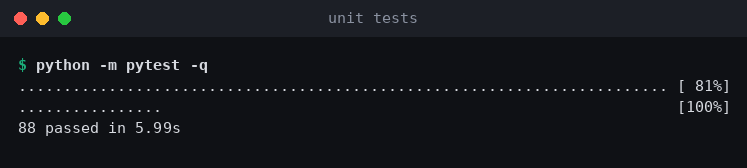
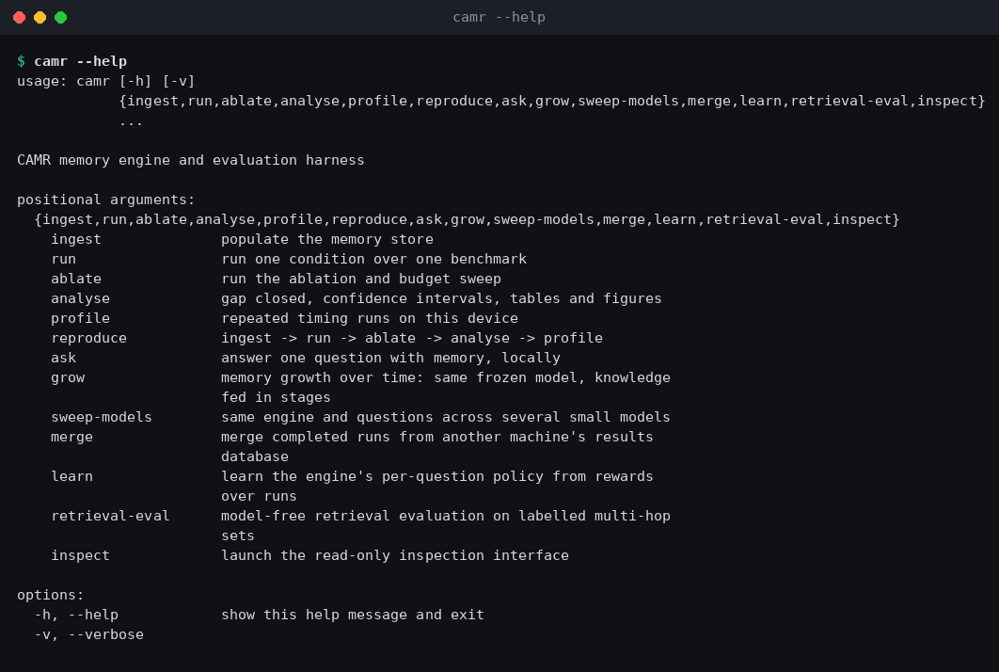
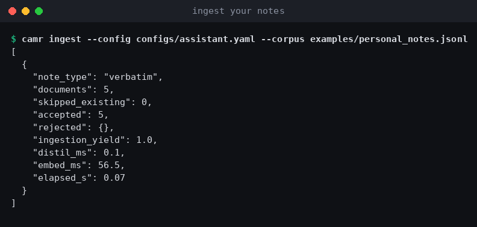
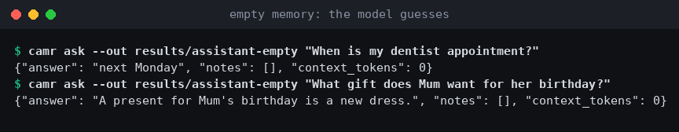
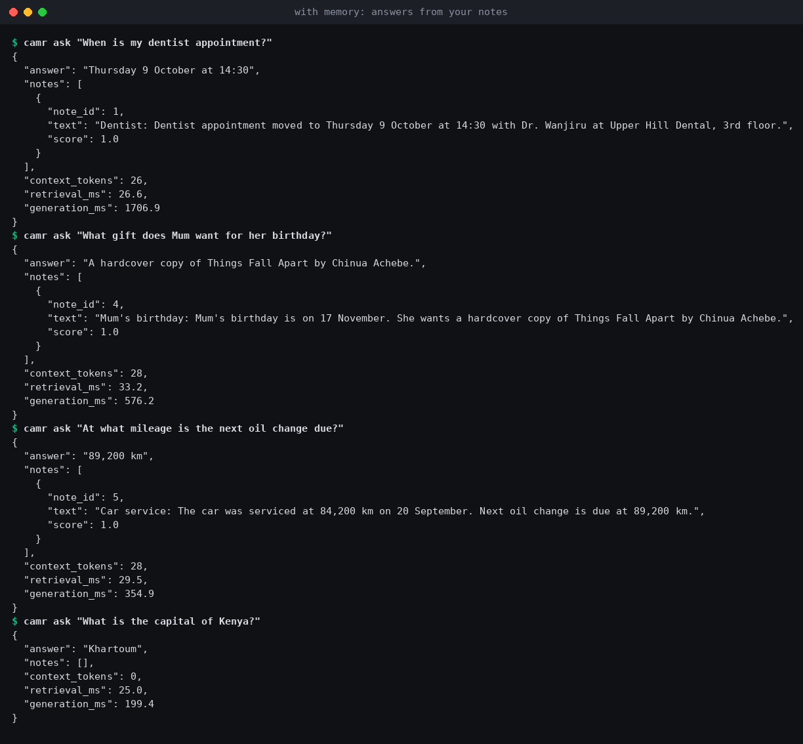
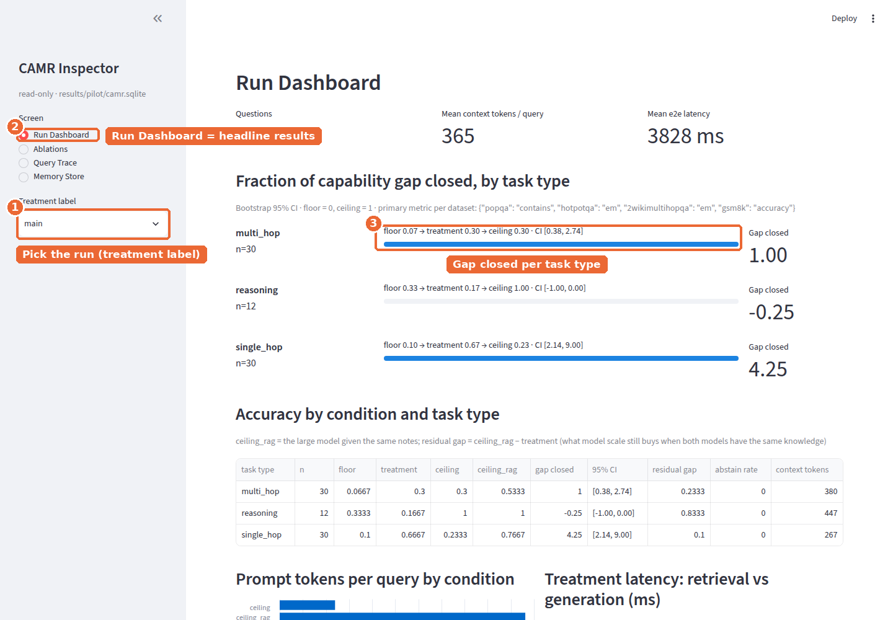
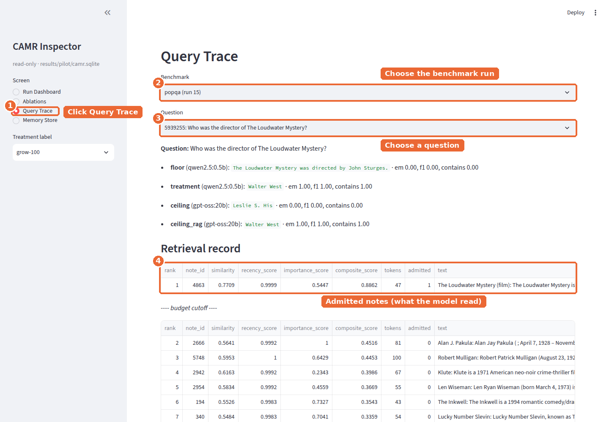
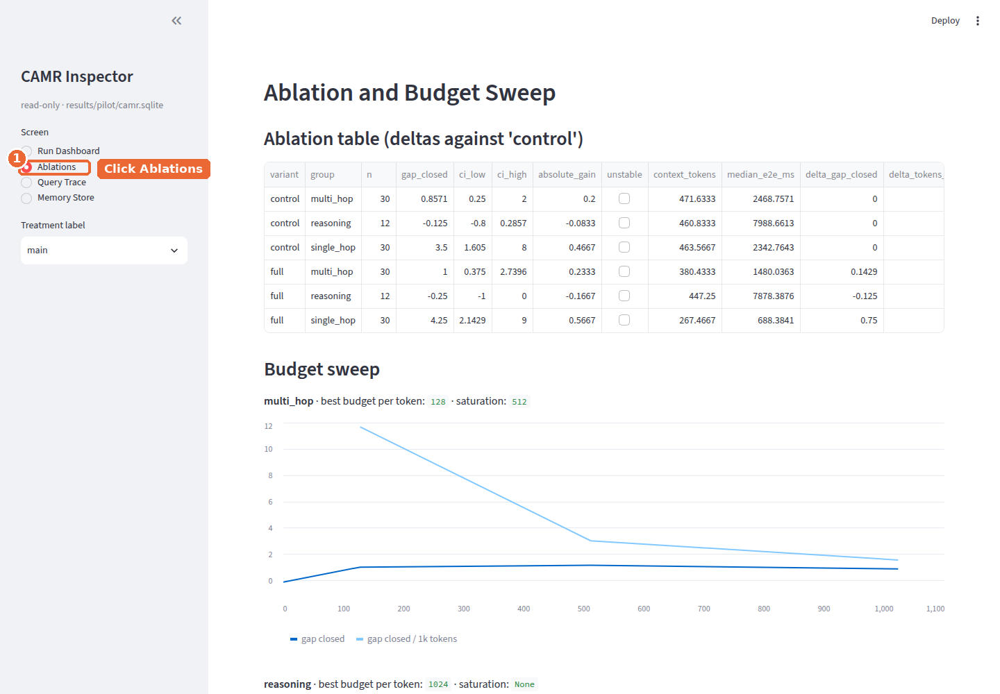
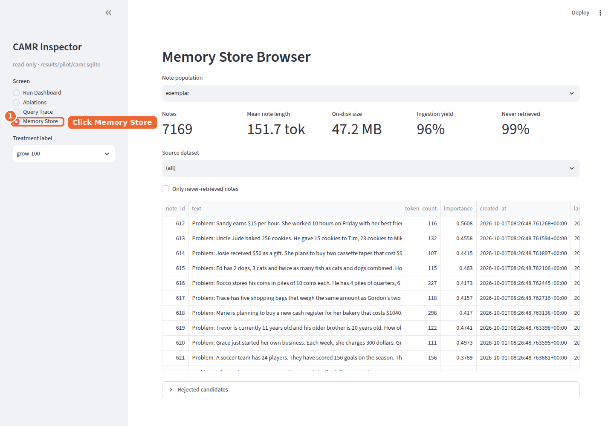

# Setting up CAMR: a walkthrough

This guide takes a fresh machine to a working engine in about 15 minutes, then
shows how to use it as a personal memory and how to open the inspector. Every
screenshot was taken from a real run on the machine described in
[`FINDINGS.md`](FINDINGS.md) §0. Steps that need you to click something have an
annotated screenshot with numbered orange markers. Steps you type are plain text.

**Tested minimum:** 4 CPU cores, 16 GB RAM, no GPU, Linux, Python 3.11,
Ollama 0.35. With `qwen2.5:0.5b` the whole system (engine and model) peaked at
about 2.7 GB of RAM ([`FINDINGS.md`](FINDINGS.md) F8).

---

## 1. Install the engine

```bash
git clone https://github.com/Satasdin/CAMR.git
cd CAMR
python -m venv .venv && source .venv/bin/activate
pip install -e ".[vec,embed,dev,inspect]"
```

Check that the install works by running the unit tests (no models or network needed):

```bash
python -m pytest -q
```



## 2. Install a local model

Install [Ollama](https://ollama.com/download), then pull one small model:

```bash
ollama pull qwen2.5:0.5b      # 0.5B, fastest; the model used throughout FINDINGS.md
# better readers, if you have the RAM (see FINDINGS.md F10):
ollama pull qwen2.5:1.5b      # beats Kimi K3 on long-tail facts with CAMR
ollama pull llama3.2:3b       # reaches Kimi K3 on multi-hop with CAMR
```

Ollama listens on `127.0.0.1:11434`. The engine refuses to send a local-model
call to any other host, so local answers never leave the machine.

The first run downloads the BGE-small embedder (about 130 MB) from Hugging Face.
After that, set `export HF_HUB_OFFLINE=1` and the engine runs fully offline.

## 3. See all commands

```bash
camr --help
```



## 4. Use it as your own memory (the assistant scenario)

Write your notes as JSON lines, one note per line (`doc_id`, `title`, `text`).
[`examples/personal_notes.jsonl`](../examples/personal_notes.jsonl) is a
five-note example. Then ingest them:

```bash
camr ingest --config configs/assistant.yaml --corpus examples/personal_notes.jsonl
```



Ask questions. Without memory, the 0.5B model invents an answer:



With the notes in memory, the same frozen model answers from them. Each answer
shows the note it used, how many tokens it read and how long retrieval and
generation took:



Look at the last question, *"What is the capital of Kenya?"*. No note was
similar enough, so the engine **abstained**: it admitted no notes and spent
0 tokens. The 0.5B model then answered from its weights and got it wrong
("Khartoum"). This is the case the learned router and the grounding cascade
([`FINDINGS.md`](FINDINGS.md) F11, F11b) are for: questions memory cannot
answer go to a stronger model.

To add more knowledge later, run `camr ingest` again with new notes. Notes
already stored are skipped, and the model's weights never change.

## 5. Reproduce the benchmarks

```bash
python scripts/fetch_data.py                      # HotpotQA, 2WikiMultiHopQA, GSM8K, PopQA (real data)
python scripts/build_popqa_corpus.py              # Wikipedia summaries for PopQA (resumable)
camr reproduce --config configs/pilot.yaml        # ingest -> floor/ceiling/treatment -> ablation -> analysis -> profile
camr grow      --config configs/pilot.yaml --stages 0.25,0.5,1.0
camr learn     --config configs/learn.yaml --phase all
```

For the cloud comparison, put the key in an environment variable, never in a
config file or in git:

```bash
export MOONSHOT_API_KEY=...        # configs/pilot_kimi.yaml reads only the variable's name
camr run --config configs/pilot_kimi.yaml --condition ceiling --benchmark popqa
```

Runs are resumable. If a run is interrupted, run the same command again and it
skips what is already done.

## 6. Open the inspector (the web view of results)

```bash
camr inspect --run-dir results/pilot              # opens http://localhost:8501
```

The inspector is read-only, because it opens the database in SQLite's `mode=ro`.

**Headline results.** ① Pick the run in *Treatment label*. ② *Run Dashboard*
is selected by default. ③ Each bar is the fraction of the capability gap closed
for one task type, with its 95% confidence interval.



**Why did the model answer that?** ① Click *Query Trace*. ② Choose the
benchmark run. ③ Choose a question. ④ The table shows the notes that were
admitted (what the model actually read). The notes below the "budget cutoff"
line were found but not sent.



**Ablations and budget sweep.** ① Click *Ablations* to compare the plain
baseline with the full engine and with each memory budget.



**What is in memory.** ① Click *Memory Store* to browse notes, their source
document and how often each note was retrieved.



## 7. Regenerate the figures and screenshots

```bash
python scripts/make_figures.py
python scripts/screenshot_inspector.py --run-dir results/pilot --out docs/figures/inspector --label main
python scripts/annotate_screenshots.py
```

## Troubleshooting

| Symptom | Cause | Fix |
|---|---|---|
| `connection refused` on 11434 | Ollama is not running | Run `ollama serve` |
| A 20B model is killed or slows to under 1 token/s | Not enough RAM; the weights are being paged | Use a ≤ 4B model, or close other programs ([`FINDINGS.md`](FINDINGS.md) F8) |
| A `resume` re-runs finished conditions | The config changed, so its hash changed | Keep the config fixed for a study ([`FINDINGS.md`](FINDINGS.md) F7 #8) |
| Retrieval is slow while the model is generating | The embedder and the model compete for CPU cores | Set `local_model.num_thread` and `embedder.torch_threads` ([`FINDINGS.md`](FINDINGS.md) F12) |
